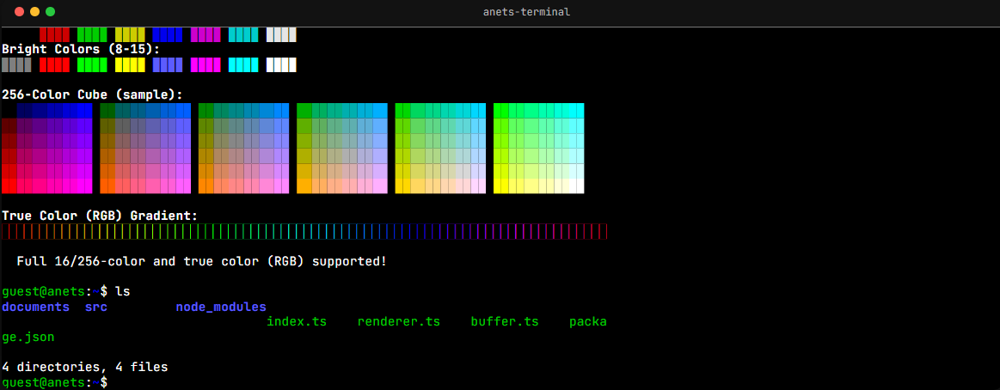

# AnetsTerminal

**An embeddable, zero-dependency web-based terminal emulator** with Canvas rendering, full ANSI color support (16-color, 256-color, true color), scrollback, mouse selection, cursor styles, and an xterm.js-compatible API.


*AnetsTerminal rendering 16-color, 256-color, and true color gradients.*

  

## ✨ Features

### Color Support
- **16 Standard ANSI Colors** — Black, Red, Green, Yellow, Blue, Magenta, Cyan, White + Bright variants
- **256-Color Mode** — Full 216-color cube + 24 grayscale tones via `ESC[38;5;N`
- **24-bit True Color (RGB)** — Full spectrum via `ESC[38;2;R;G;B`
- **Background Colors** — All color modes work as background too (`ESC[48;...`)
- **Color + Style Combinations** — Bold red, italic green on blue, etc.

### Text Styles
- **Bold** (`\x1b[1m`), **Dim** (`\x1b[2m`), **Italic** (`\x1b[3m`)
- **Underline** (`\x1b[4m`), **Blink** (`\x1b[5m`), **Inverse** (`\x1b[7m`)
- **Strikethrough** (`\x1b[9m`), **Hidden** (`\x1b[8m`)
- **Combined** — Bold+Italic, Bold+Underline, Italic+Underline, etc.

### Fonts
- **Configurable font family** — Any monospace font: Courier New, Consolas, Fira Code, JetBrains Mono, etc.
- **Configurable font size** — Any pixel size (default 15px)
- **Line height** — Adjustable multiplier (default 1.2)
- **Letter spacing** — Adjustable pixel spacing (default 0)
- **Runtime changes** — Change font on the fly with `term.setFont('Fira Code', 18)`

### Cursor
- **Block** (default), **Underline**, **Bar** cursor styles
- **Blinking** or steady cursor
- **Cursor color** — Customizable via theme

### Rendering
- **Canvas-based** — High-performance HTML5 Canvas rendering
- **HiDPI/Retina** — Automatic device pixel ratio handling
- **Scrollback** — Configurable buffer (default 1000 lines), mouse wheel navigation
- **Mouse Selection** — Click, drag, double-click word selection, clipboard copy
- **Dynamic Resize** — `term.resize(cols, rows)` at any time

### ANSI Escape Sequences
- **CSI** — Cursor movement (CUU/CUD/CUF/CUB/CUP/CNL/CPL/CHA/VPA)
- **Erase** — ED (erase display), EL (erase line), ECH (erase chars)
- **Scroll** — SU (scroll up), SD (scroll down), DECSTBM (scroll region)
- **Insert/Delete** — ICH, DCH, IL, DL
- **SGR** — All text attributes and colors (see Color Support above)
- **Modes** — DECSET/DECRST (cursor keys, auto-wrap, origin, cursor visibility)
- **OSC** — Window title (OSC 0/2)
- **Tabs** — HT, TBC (tab stops)
- **Save/Restore Cursor** — DECSC/DECRC

### Backend Integration
- **WebSocket Backend** — Connect to any WebSocket server
- **BaseBackend** — Abstract class for custom backends (SSH proxy, custom protocols)
- **`attachWebSocket()`** — Quick-connect utility function

### Built-in Themes
- Default (classic dark)
- One Dark
- Solarized Dark
- Dracula
- Custom themes via `mergeTheme()` or partial theme objects

## 🚀 Quick Start

### 1. Install

```bash
npm install anets-terminal
```

### 2. Create a terminal

```typescript
import { AnetsTerminal } from 'anets-terminal';

const term = new AnetsTerminal({
  cols: 80,
  rows: 24,
  cursorBlink: true,
});

term.open(document.getElementById('terminal'));
term.write('\x1b[32mHello, World!\x1b[0m\r\n');

// Handle user input
term.on(TerminalEvent.Data, (data) => {
  console.log('User typed:', data);
});
```

### 3. Connect to a backend

```typescript
import { attachWebSocket } from 'anets-terminal';

// Quick WebSocket connection
const backend = attachWebSocket(term, 'ws://localhost:8080');
```

That's it! See [HOWTO guides](docs/HOWTO/) for detailed use cases.

## 📦 Installation

```bash
npm install anets-terminal
```

## 🎨 Color Usage

### 16 Standard Colors

```javascript
// Foreground colors
term.write('\x1b[30mBlack\x1b[0m ');
term.write('\x1b[31mRed\x1b[0m ');
term.write('\x1b[32mGreen\x1b[0m ');
term.write('\x1b[33mYellow\x1b[0m ');
term.write('\x1b[34mBlue\x1b[0m ');
term.write('\x1b[35mMagenta\x1b[0m ');
term.write('\x1b[36mCyan\x1b[0m ');
term.write('\x1b[37mWhite\x1b[0m ');

// Bright foreground (codes 90-97)
term.write('\x1b[91mBright Red\x1b[0m ');
term.write('\x1b[92mBright Green\x1b[0m ');

// Background colors (codes 40-47, 100-107)
term.write('\x1b[43mYellow BG\x1b[0m ');
term.write('\x1b[104mBright Blue BG\x1b[0m ');
```

### 256-Color Mode

```javascript
// Foreground with 256-color palette
term.write('\x1b[38;5;196mRed 256\x1b[0m ');

// Background with 256-color palette
term.write('\x1b[48;5;21mBlue BG 256\x1b[0m ');
```

### True Color (24-bit RGB)

```javascript
// Foreground with RGB
term.write('\x1b[38;2;255;128;0mOrange\x1b[0m ');

// Background with RGB
term.write('\x1b[48;2;0;128;255mBlue BG\x1b[0m ');

// Combined fg + bg
term.write('\x1b[38;2;255;255;255;48;2;0;100;200mWhite on Blue\x1b[0m ');
```

### Text Styles

```javascript
term.write('\x1b[1mBold\x1b[0m ');
term.write('\x1b[2mDim\x1b[0m ');
term.write('\x1b[3mItalic\x1b[0m ');
term.write('\x1b[4mUnderline\x1b[0m ');
term.write('\x1b[5mBlink\x1b[0m ');
term.write('\x1b[7mInverse\x1b[0m ');
term.write('\x1b[9mStrikethrough\x1b[0m ');

// Combined: Bold + Italic + Red
term.write('\x1b[1;3;31mBold Italic Red\x1b[0m ');
```

## 🔤 Fonts

### Set at Creation

```javascript
const term = new AnetsTerminal({
  fontFamily: 'Fira Code, Consolas, monospace',
  fontSize: 16,
  lineHeight: 1.3,
  letterSpacing: 0.5,
});
```

### Change at Runtime

```javascript
// Change font family
term.setFont('JetBrains Mono');

// Change font family and size
term.setFont('Consolas', 18);
```

## 📜 Scrollbar & Scrolling

### Show Scrollbar

```javascript
const term = new AnetsTerminal({
  showScrollbar: true,
});
term.open(document.getElementById('terminal'));
```

### Mouse Scroll

```javascript
const term = new AnetsTerminal({
  enableMouseScroll: true,  // true by default
});
```

### Programmatic Scrolling

```javascript
term.scrollTo(10);      // Scroll to offset
term.scrollToBottom();  // Scroll to bottom
const offset = term.scrollOffset;
```

## 🎭 Themes

### Built-in Themes

```javascript
import { DEFAULT_THEME, ONE_DARK_THEME, SOLARIZED_DARK_THEME, DRACULA_THEME } from 'anets-terminal';

// Use at creation
const term = new AnetsTerminal({ theme: ONE_DARK_THEME });

// Change at runtime
term.setTheme(DRACULA_THEME);
```

### Custom Themes

```javascript
// Partial theme (merges with defaults)
term.setTheme({
  background: '#1e1e2e',
  foreground: '#cdd6f4',
  cursor: '#f5e0dc',
  green: '#a6e3a1',
  red: '#f38ba8',
});
```

## 📡 Backend Integration

### WebSocket (Live Shell)

```javascript
import { AnetsTerminal, WebSocketBackend, TerminalEvent } from 'anets-terminal';

const term = new AnetsTerminal();
term.open(container);

const ws = new WebSocket('ws://localhost:8080/pty');
const backend = new WebSocketBackend(term, ws);
backend.attach();

// Or use the shortcut:
// import { attachWebSocket } from 'anets-terminal';
// const backend = attachWebSocket(term, 'ws://localhost:8080/pty');
```

### Custom Backend

```javascript
import { AnetsTerminal, BaseBackend, TerminalEvent } from 'anets-terminal';

class MySSHBackend extends BaseBackend {
  private sshConnection: any;

  protected onInput(data: string): void {
    this.sshConnection.send(data);
  }

  protected onAttach(): void {
    this.sshConnection = createSSHConnection('user@host');
    this.sshConnection.onOutput((output: string) => {
      this.write(output);
    });
  }

  protected onDetach(): void {
    this.sshConnection.close();
  }
}

const term = new AnetsTerminal();
term.open(container);

const backend = new MySSHBackend();
backend.attach(term);
```

## 📋 API Reference

### Constructor Options

| Option | Type | Default | Description |
|---|---|---|---|
| `cols` | `number` | `80` | Number of columns |
| `rows` | `number` | `24` | Number of rows |
| `fontFamily` | `string` | `'Ubuntu Mono, Consolas, monospace'` | Font family |
| `fontSize` | `number` | `13` | Font size in pixels |
| `lineHeight` | `number` | `1.2` | Line height multiplier |
| `letterSpacing` | `number` | `0` | Letter spacing in pixels |
| `scrollback` | `number` | `1000` | Scrollback buffer lines |
| `theme` | `Partial<TerminalTheme>` | `{}` | Color theme |
| `cursorStyle` | `'block'\|'underline'\|'bar'` | `'block'` | Cursor style |
| `cursorBlink` | `boolean` | `true` | Cursor blink |
| `focusOnOpen` | `boolean` | `false` | Focus on open |
| `wordSeparators` | `string` | `' ()[]{}'"'` | Word boundary characters |
| `showScrollbar` | `boolean` | `false` | Show scrollbar on the right |
| `enableMouseScroll` | `boolean` | `true` | Enable scrolling with mousewheel |

### Methods

| Method | Description |
|---|---|
| `open(container)` | Mount terminal to a DOM element |
| `write(data)` | Write string or `Uint8Array` to terminal |
| `writeln(data)` | Write data + `\r\n` |
| `on(event, callback)` | Register event handler |
| `off(event, callback)` | Remove event handler |
| `focus()` | Focus the terminal |
| `blur()` | Blur the terminal |
| `resize(cols, rows)` | Resize the terminal |
| `clear()` | Clear buffer and reset cursor |
| `scrollTo(offset)` | Scroll to scrollback position |
| `scrollToBottom()` | Scroll to bottom |
| `reset()` | Reset to initial state |
| `dispose()` | Clean up and remove from DOM |
| `setTheme(theme)` | Set color theme (partial or full) |
| `setFont(family?, size?)` | Change font at runtime |
| `getSelection()` | Get selected text |
| `clearSelection()` | Clear selection |

### Properties

| Property | Type | Description |
|---|---|---|
| `cols` | `number` | Current column count |
| `rows` | `number` | Current row count |
| `cursorX` | `number` | Cursor X position |
| `cursorY` | `number` | Cursor Y position |
| `title` | `string` | Terminal title (set via OSC) |
| `scrollOffset` | `number` | Current scroll offset |
| `isFocused` | `boolean` | Whether terminal is focused |
| `buffer` | `Buffer` | Direct buffer access |

### Events (`TerminalEvent`)

| Event | Args | Description |
|---|---|---|
| `Data` | `string` | User input (keyboard) |
| `Binary` | `Uint8Array` | Binary data |
| `Resize` | `{cols, rows}` | Terminal resized |
| `Title` | `string` | Title changed (OSC 0/2) |
| `Bell` | — | Bell triggered (`\x07`) |
| `Focus` | — | Terminal focused |
| `Blur` | — | Terminal blurred |
| `Selection` | — | Text selected |
| `Scroll` | `number` | Scroll position changed |
| `LineFeed` | — | Line feed executed |

## 🎮 Interactive Demo

Open `demo/index.html` in a browser to see an interactive terminal with a simulated shell.

| Command | Description |
|---|---|
| `help` | Show all available commands |
| `color` | Full color demo (16-color, 256-color, true color) |
| `colors` | Basic color palette |
| `font <family> [size]` | Change font at runtime |
| `banner` | ASCII art banner |
| `neofetch` | System info display |
| `cowsay <text>` | Cowsay! |
| `matrix` | Matrix rain animation |
| `clear` | Clear terminal |
| `resize <cols> <rows>` | Resize terminal |
| `echo <text>` | Echo text back |
| `date` | Current date/time |
| `whoami` | Show current user |
| `ls` | List files |
| `history` | Command history |

**UI Buttons:**
- 🎨 **Theme selector** — Switch between Default, One Dark, Solarized Dark, Dracula
- 🅰️ **Font Demo** — Shows all text styles
- 🌈 **Color Demo** — Complete color showcase
- 📐 **Resize** — Toggle between sizes

## 🏗️ Architecture

```
┌─────────────────────────────────────────┐
│            AnetsTerminal               │
│  (Public API, Event System, Modes)      │
├──────────────┬─────────────────────────┤
│  AnsiParser  │       Buffer            │
│  (State      │  (Cell Grid, Scrolling, │
│   Machine)   │   Scrollback)           │
├──────────────┼─────────────────────────┤
│ InputHandler │       Renderer          │
│ (Keyboard,   │  (Canvas 2D, Cursor,     │
│  Mouse,      │   Selection, Colors)    │
│  Selection)  │                         │
├──────────────┴─────────────────────────┤
│          Backend Interface             │
│  (WebSocket, BaseBackend, Custom)      │
└─────────────────────────────────────────┘
```

## 🔧 Development

```bash
# Install dependencies
npm install

# Build for distribution (IIFE + ESM + types)
npm run build

# Build demo bundle
npm run build:demo

# Watch mode for development
npm run dev

# Type check
npm run typecheck
```

### Output Files

| File | Format | Size | Description |
|---|---|---|---|
| `dist/anets-terminal.js` | IIFE | ~75KB | Browser global (`AnetsTerminal`) |
| `dist/anets-terminal.mjs` | ESM | ~69KB | ES module import |
| `dist/index.d.ts` | Types | — | TypeScript declarations |
| `demo/anets-terminal.js` | IIFE | ~75KB | Demo bundle |

## 📄 License

MIT — see [LICENSE](LICENSE)